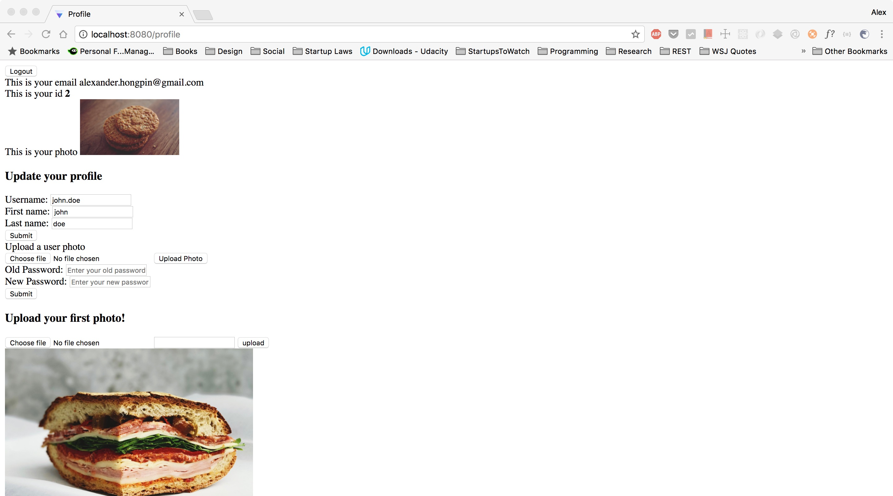

# Instago

A modern Instagram created with Golang as the backend and Elm as the frontend.

The goal of the project is to understand how productive can it be to code an app using Golang. I simply choose Instagram for no particular reason. 

For the database, I'll be using Postgres. 


## Architecture

### What is the best way to store configs? 

According to the 12-Factor-App, configs should be stored in the environment variables. How does it apply in Golang?

### What is the best practices to use Postgres with Golang?

I'm still exploring this particular area. The current way is to just store a global sql context.

There are some issues that I encountered when working datetime conversion and postgres array in Golang.

### Designing models

C'mon, models should be fat. How can I make my models more useful?

### Deployment

Docker? Found a good tutorial [here](https://www.iron.io/an-easier-way-to-create-tiny-golang-docker-images/).
Remember to call `godep save -r` before building a static binary with the name `your_binary_name`:

```bash
$ docker run --rm -it -v "$GOPATH":/gopath -v "$(pwd)":/app -e "GOPATH=/gopath" -w /app golang:1.4.2 sh -c 'CGO_ENABLED=0 go build -a --installsuffix cgo --ldflags="-s" -o your_binary_name'
```

Building the docker image is straightforward:
```dockerfile
FROM iron/base
WORKDIR /app
# copy binary into image
COPY hello /app/
ENTRYPOINT ["./your_binary_name"]
```

Run the dockerfile to build the image:

```bash
$ docker build -t treeder/go-hello-http .
```

Now run it:
```bash
$ docker run --rm -it -p 8080:8080 treeder/go-hello-http
```


## Current progress

Watch me throw some css magic dust on this...



